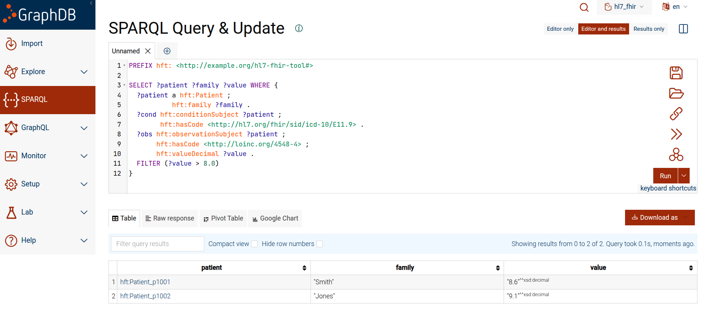

# HL7 -> FHIR Tool

[](https://github.com/shaolinpat/hl7_fhir_tool/actions/workflows/ci.yml)
[](https://codecov.io/gh/shaolinpat/hl7_fhir_tool)  
[](https://www.python.org/downloads/release/python-3110/)
[](LICENSE)

This project demonstrates a complete HL7 -> FHIR -> RDF interoperability pipeline. HL7 v2 messages (ADT, ORM, ORU) are transformed into FHIR Bundles -- containing Patient, Encounter, Condition, ServiceRequest, Observation, and DiagnosticReport resources with ICD-10 and LOINC code bindings. Those FHIR Bundles are then serialized into RDF/Turtle using a published OWL ontology (`https://w3id.org/shaolinpat/hft#`), forming a coherent graph that supports SHACL-based data quality validation and SPARQL cohort queries. The result is a full proof-of-concept showing how legacy HL7 feeds can be normalized into FHIR and elevated into a semantic data layer suitable for analytics, reasoning, and deployment in a graph database such as GraphDB or Apache Jena.

---

## Table of Contents

- [Why This Project Matters](#why-this-project-matters)
  - [Why SPARQL and SHACL Belong Here](#why-sparql-and-shacl-belong-here)
  - [Java Integration Pathways](#java-integration-pathways)
- [Why LOINC Matters Here](#why-loinc-matters-here)
- [Why ICD-10 Matters Here](#why-icd-10-matters-here)
- [HL7 to FHIR Flow Diagram](#hl7-to-fhir-flow-diagram)
- [Features](#features)
- [Installation](#installation)
- [Usage](#usage)
  - [Parse HL7 v2 messages](#parse-hl7-v2-messages)
  - [Parse FHIR JSON or XML](#parse-fhir-json-or-xml)
  - [Transform HL7 v2 -> FHIR](#transform-hl7-v2--fhir)
    - [ADT^A01 (Admit)](#adta01-admit)
    - [ADT^A03 (Discharge)](#adta03-discharge)
    - [ORM^O01 (Order)](#ormo01-order)
    - [ORU^R01 (Observation Result)](#orur01-observation-result)
    - [List supported events](#list-supported-events)
  - [Serialize HL7 -> FHIR Bundle JSON](#serialize-hl7---fhir-bundle-json)
  - [Serialize FHIR Bundle JSON -> RDF](#serialize-fhir-bundle-json---rdf)
- [HL7 Stream Generator](#hl7-stream-generator)
- [End-to-End Pipeline](#end-to-end-pipeline)
- [Development](#development)
- [Continuous Integration](#continuous-integration)
- [Status](#status)
- [Ontology Model](#ontology-model)
- [GraphDB Integration](#graphdb-integration)
- [SPARQL Testing](#sparql-testing)
- [SHACL Testing](#shacl-testing)
- [License](#license)

---

## Why This Project Matters

Healthcare systems still run on HL7 v2 (ADT/ORU/ORM messages) while modern interoperability and analytics increasingly depend on FHIR APIs and knowledge graphs. This repo bridges that gap:

- **HL7 v2 -> FHIR**: Transforms core events (ADT^A01 admit, ADT^A03 discharge, ADT^A08 patient update, ORU lab results, ORM orders) into clean FHIR resources (Patient, Encounter, Condition, Observation, ServiceRequest, DiagnosticReport).  
- **Standards Alignment**: Positions legacy hospital feeds for use in FHIR-native apps, analytics platforms, and regulatory use cases (patient access, care coordination, research).  
- **Data Reuse**: Converts brittle, site-specific HL7 v2 streams into structured, web-friendly FHIR models that downstream systems can trust.  

### Why SPARQL and SHACL Belong Here

- **Knowledge Graph Analytics**: FHIR JSON is great for APIs, but cohort building, quality rules, and cross-encounter reasoning shine in RDF. Serializing FHIR to RDF enables:  
  - SPARQL queries for cohorts, outcomes, and KPI dashboards.  
  - SHACL constraints for data quality and conformance checks (e.g., every Encounter must have a Patient; Observations must have LOINC codes where expected).  

### Java Integration Pathways

A Java integration layer is planned for a future phase. Many hospitals and integration engines run on the JVM, and the FHIR outputs this pipeline produces are well-suited for consumption by HAPI FHIR, Mirth/NextGen Connect, and Spring Integration. See the open issue for scope and design notes.

---

## Why LOINC Matters Here

Lab results and clinical observations are only as useful as the codes behind them. Different hospitals and labs label the same test in inconsistent ways ("Glucose, fasting plasma" vs. "FPG" vs. "GLU-F"). The Logical Observation Identifiers Names and Codes (LOINC) standard provides a universal vocabulary for lab tests, vital signs, and other measurements.

- **HL7 v2**: ORU messages carry test identifiers in OBX segments, which can (and should) reference LOINC codes.  
- **FHIR**: Observations and DiagnosticReports are expected to use LOINC as their coding system, ensuring that "glucose test" means the same thing everywhere.  
- **RDF/SPARQL**: Once FHIR Observations are serialized into RDF, LOINC codes allow cross-institution queries like:  
  - "Find all patients with HbA1c (LOINC 4548-4) above 8.0."  
  - "Count distinct LOINC-coded blood pressure observations in the last 6 months."  

By including LOINC in the HL7 -> FHIR transformation, this project not only normalizes messy legacy data but also anchors it in the globally recognized clinical coding ecosystem, enabling meaningful analytics, interoperability, and quality checks across systems.

---

## Why ICD-10 Matters Here

If LOINC tells us *what was measured*, ICD-10 tells us *what condition the patient has*. ICD-10 (International Classification of Diseases, 10th Revision) is the global standard for diagnoses, used in clinical care, research, and billing. Together with LOINC, it anchors HL7 -> FHIR transformations in a standardized coding ecosystem.

- **HL7 v2**: Diagnoses typically appear in DG1 segments, where ICD-10 codes represent admitting, discharge, or encounter-associated conditions (e.g., E11.9 = Type 2 diabetes mellitus without complications).  
- **FHIR**: Diagnoses are captured as `Condition` resources with ICD-10 codes, linked to patients and encounters, and can be cross-referenced with Observations.  
- **RDF/SPARQL**: ICD-10 enables semantic queries such as:  
  - "Find all patients discharged with ICD-10 I21 (acute myocardial infarction)."  
  - "Count patients with ICD-10 E11.9 who also have an HbA1c (LOINC 4548-4) test over 8.0."  

By including ICD-10 in the HL7 -> FHIR transformation, this project does more than parse messages -- it aligns patient encounters and diagnoses with internationally recognized codes. That ensures the data can be used reliably for analytics, interoperability, regulatory reporting, and reimbursement.

---

## HL7 to FHIR Flow Diagram

The diagram below summarizes how HL7 v2 messages (ADT, ORM, ORU) map to FHIR resources, and where ICD-10 and LOINC fit in.  
It also shows RDF/SPARQL/SHACL and (yet to be implemented) Java integration layers.


---

## Features

- Parse HL7 v2 messages (using [`hl7apy`](https://crs4.github.io/hl7apy/))
- Parse FHIR JSON or XML (using [`fhir.resources`](https://github.com/nazrulworld/fhir.resources))
- Transform HL7 v2 -> FHIR resource structures (ADT^A01/A03/A08, ORM^O01, ORU^R01)
- DG1 segment parsing -> FHIR Condition resources with ICD-10 code bindings (ADT^A01/A03/A08)
- Two-stage pipeline: `to-fhir` serializes HL7 -> FHIR Bundle JSON; `to-rdf` serializes FHIR Bundle JSON -> RDF/Turtle
- RDF serialization uses a published OWL ontology (`https://w3id.org/shaolinpat/hft#`, `rdfs:subClassOf fhir:`)
- Encounter-to-Condition linking via `hft:hasCondition` enables cohort SPARQL queries
- Load RDF output into GraphDB and run SPARQL cohort queries
- Single-command end-to-end pipeline: generate HL7 -> FHIR Bundle -> RDF -> GraphDB via `tools/run_pipeline.sh`
- Minimal, production-style CLI for batch and file-level workflows
- 100% pytest coverage with CI/CD via GitHub Actions and Codecov

> **Note:** This tool is intentionally **one-way (HL7 v2 -> FHIR only)**. Reverse transformation (FHIR -> HL7) is not supported.

---

## Installation

Clone the repo and create the Conda environment:

```bash
git clone git@github.com:shaolinpat/hl7_fhir_tool.git
cd hl7_fhir_tool
conda env create -f environment.yml
conda activate hl7_fhir_env
```

---

## Usage

The CLI is installed as a Python entry point. Run with:

```bash
python -m src.hl7_fhir_tool.cli --help
```

### Parse HL7 v2 messages
```bash
python -m src.hl7_fhir_tool.cli parse-hl7 tests/data/adt_a01_251.hl7
```
_Output (segments pretty-printed):_
```
MSH|^~\&|HIS|RIH|EKG|EKG|20250101123000||ADT^A01|MSG00001|P|2.5.1
EVN|A01|20250101123000
PID|1||12345^^^MRN||Doe^John^^^^^L||19700101|M|||123 Main St^^Cincinnati^OH^45220||5551234567
PV1|1|I|2000^2012^01||||1234^Physician^Primary
```

### Parse FHIR JSON or XML
```bash
python -m src.hl7_fhir_tool.cli parse-fhir tests/data/patient.json
```
_Output:_
```json
{
  "resourceType": "Patient",
  "id": "p1",
  "name": [
    {
      "family": "Doe",
      "given": [
        "John"
      ]
    }
  ],
  "gender": "male",
  "birthDate": "1970-01-01"
}
```

### Transform HL7 v2 -> FHIR

#### ADT^A01 (Admit)

_Without DG1:_
```bash
python -m src.hl7_fhir_tool.cli transform tests/data/adt_a01_251.hl7 --stdout --pretty
```
_Output:_
```json
{
  "resourceType": "Patient",
  "id": "12345",
  "identifier": [
    {
      "value": "12345"
    }
  ],
  "name": [
    {
      "family": "Doe",
      "given": [
        "John"
      ]
    }
  ],
  "gender": "male",
  "birthDate": "1970-01-01"
}

{
  "resourceType": "Encounter",
  "id": "enc-12345",
  "status": "in-progress",
  "class": [
    {
      "coding": [
        {
          "system": "http://terminology.hl7.org/CodeSystem/v3-ActCode",
          "code": "IMP",
          "display": "inpatient encounter"
        }
      ]
    }
  ]
}
```

_With DG1 (ICD-10 diagnosis):_
```bash
python -m src.hl7_fhir_tool.cli transform tests/data/adt_a01_with_dg1.hl7 --stdout --pretty
```
_Output:_
```json
{
  "resourceType": "Patient",
  "id": "12345",
  "identifier": [
    {
      "value": "12345"
    }
  ],
  "name": [
    {
      "family": "Doe",
      "given": [
        "John"
      ]
    }
  ],
  "gender": "male",
  "birthDate": "1970-01-01"
}

{
  "resourceType": "Encounter",
  "id": "enc-12345",
  "status": "in-progress",
  "class": [
    {
      "coding": [
        {
          "system": "http://terminology.hl7.org/CodeSystem/v3-ActCode",
          "code": "IMP",
          "display": "inpatient encounter"
        }
      ]
    }
  ]
}

{
  "resourceType": "Condition",
  "id": "cond-12345-1",
  "clinicalStatus": {
    "coding": [
      {
        "system": "http://terminology.hl7.org/CodeSystem/condition-clinical",
        "code": "active",
        "display": "Active"
      }
    ]
  },
  "code": {
    "coding": [
      {
        "system": "http://hl7.org/fhir/sid/icd-10",
        "code": "E11.9"
      }
    ],
    "text": "Type 2 diabetes mellitus without complications"
  },
  "subject": {
    "reference": "Patient/12345"
  }
}
```

#### ADT^A03 (Discharge)

_Minimal example:_
```bash
python -m src.hl7_fhir_tool.cli transform tests/data/adt_a03_min.hl7 --stdout --pretty
```
_Output:_
```json
{
  "resourceType": "Patient",
  "id": "12345",
  "name": [
    {
      "family": "Doe",
      "given": [
        "Jane"
      ]
    }
  ]
}

{
  "resourceType": "Encounter",
  "id": "enc-12345",
  "status": "finished",
  "class": [
    {
      "coding": [
        {
          "code": "I"
        }
      ]
    }
  ]
}
```

#### ORM^O01 (Order)

_Minimal example:_
```bash
python -m src.hl7_fhir_tool.cli transform tests/data/orm_o01_min.hl7 --stdout --pretty
```
_Output:_
```json
{
  "resourceType": "Patient",
  "id": "12345",
  "name": [
    {
      "family": "Doe",
      "given": [
        "John"
      ]
    }
  ],
  "gender": "male",
  "birthDate": "1970-01-01"
}

{
  "resourceType": "ServiceRequest",
  "id": "ORD123",
  "identifier": [
    {
      "value": "ORD123"
    }
  ],
  "status": "active",
  "intent": "order",
  "subject": {
    "reference": "Patient/12345"
  }
}
```

_Mapping notes:_
- **ORC-2/ORC-3** -> `ServiceRequest.identifier` (placer/filler numbers)
- **ORC-5** (order status) -> `ServiceRequest.status` (e.g., `NW` -> `active`, `CA` -> `revoked`, `CM` -> `completed`)
- **OBR-4** (Universal Service ID) -> `ServiceRequest.code` (prefer LOINC when available)
- **PID** -> `Patient` (linked via `ServiceRequest.subject`)

#### ORU^R01 (Observation Result)

_Minimal example:_
```bash
python -m src.hl7_fhir_tool.cli transform tests/data/oru_r01_min.hl7 --stdout --pretty
```
_Output:_
```json
{
  "resourceType": "Patient",
  "id": "P12345",
  "name": [
    {
      "family": "Doe",
      "given": [
        "Jane"
      ]
    }
  ],
  "gender": "female",
  "birthDate": "1983-05-14"
}

{
  "resourceType": "Observation",
  "id": "obs-P12345-1",
  "status": "final",
  "code": {
    "coding": [
      {
        "code": "GLU"
      }
    ],
    "text": "Glucose"
  },
  "subject": {
    "reference": "Patient/P12345"
  },
  "valueQuantity": {
    "value": 110.0,
    "unit": "mg/dL"
  }
}
```

_Mapping notes:_
- **OBR-2/OBR-3** -> `Observation.identifier` (placer/filler numbers)
- **OBR-7** -> `Observation.effectiveDateTime` (date/time of observation)
- **OBX-2/OBX-5/OBX-6** -> `Observation.valueQuantity` or `Observation.valueString`
- **OBX-3** -> `Observation.code` (use LOINC if available)
- **PID** -> `Patient` (linked via `Observation.subject`)

### List supported events

```bash
python -m src.hl7_fhir_tool.cli transform - --list
```
_Output:_
```
Registered HL7 v2 -> FHIR events:
    ADT^A01
    ADT^A03
    ADT^A08
    ORM^O01
    ORU^R01
```

### Serialize HL7 -> FHIR Bundle JSON

`to-fhir` is stage 1 of the two-stage pipeline. It transforms an HL7 v2 message into a
FHIR Bundle (type: collection) and writes it to disk as JSON. The Bundle contains one
entry per resource produced by the transformer.

```bash
python -m src.hl7_fhir_tool.cli to-fhir tests/data/adt_a01_with_dg1.hl7 --output-dir out/fhir/
```
_Output:_
```
Wrote out/fhir/adt_a01_with_dg1.json (3 resources)
```

Write to stdout:
```bash
python -m src.hl7_fhir_tool.cli to-fhir tests/data/adt_a01_with_dg1.hl7 --stdout --pretty
```

### Serialize FHIR Bundle JSON -> RDF

`to-rdf` is stage 2 of the two-stage pipeline. It accepts either a FHIR Bundle `.json`
file produced by `to-fhir` (stage 2) or an HL7 `.hl7` file directly (single-stage).

_Stage 2 (from FHIR Bundle):_
```bash
python -m src.hl7_fhir_tool.cli to-rdf out/fhir/adt_a01_with_dg1.json --output-dir out/rdf/
```
_Output:_
```
Wrote out/rdf/adt_a01_with_dg1.ttl (13 triples)
```

_Single-stage (from HL7 directly):_
```bash
python -m src.hl7_fhir_tool.cli to-rdf tests/data/adt_a01_with_dg1.hl7 --output-dir out/rdf/
```

_Sample Turtle output:_
```turtle
@prefix hft: <https://w3id.org/shaolinpat/hft#> .
@prefix xsd: <http://www.w3.org/2001/XMLSchema#> .

hft:Encounter_enc-12345 a hft:Encounter ;
    hft:encounterSubject hft:Patient_12345 ;
    hft:hasCondition hft:Condition_cond-12345-1 ;
    hft:status "in-progress"^^xsd:string .

hft:Condition_cond-12345-1 a hft:Condition ;
    hft:conditionSubject hft:Patient_12345 ;
    hft:hasCode <http://hl7.org/fhir/sid/icd-10/E11.9> .

hft:Patient_12345 a hft:Patient ;
    hft:birthDate "1970-01-01"^^xsd:date ;
    hft:family "Doe"^^xsd:string ;
    hft:gender hft:male ;
    hft:given "John"^^xsd:string ;
    hft:identifier "12345"^^xsd:string .
```

Each `hft:` class declares `rdfs:subClassOf` its canonical `fhir:` counterpart, making
the `hft:` namespace an extension of FHIR rather than a parallel vocabulary. The ontology
is published at `https://w3id.org/shaolinpat/hft#`.

Write to stdout instead of a file:

```bash
python -m src.hl7_fhir_tool.cli to-rdf out/fhir/adt_a01_with_dg1.json --stdout
```

---

## HL7 Stream Generator

A synthetic HL7 v2.5.1 generator is included for producing realistic test streams for all
supported message types (ADT^A01, ADT^A03, ADT^A08, ORM^O01, ORU^R01).

ADT messages (A01, A03, A08) include a `DG1` segment with a randomly selected ICD-10 code
drawn from a built-in pool of eight common diagnoses.

In `mixed_registered` mode the generator guarantees a diabetic cohort: the first 20 message
slots produce 10 paired ADT^A01 (E11.9) + ORU^R01 (LOINC 4548-4, HbA1c > 8.0) messages
sharing the same MRN. This ensures the cohort SPARQL query returns results regardless of
total message count.

Example (100-message mixed stream):

```bash
python scripts/generate_hl7_adt_a01_bulk.py \
    --count 100 \
    --message-type mixed_registered \
    --out out/hl7 \
    --seed 22 \
    --line-endings cr
```

The generator is deterministic under a fixed seed and produces only HL7 input for the
transformation layer.

---

## End-to-End Pipeline

`tools/run_pipeline.sh` runs the full pipeline in one command:

1. Generate synthetic HL7 messages
2. Transform each HL7 message to a FHIR Bundle JSON (`to-fhir`)
3. Transform each FHIR Bundle JSON to RDF/Turtle (`to-rdf`)
4. Clear the GraphDB repository
5. Load the ontology TTL (required for RDFS inference)
6. Load all data Turtle files into GraphDB

The ontology (`rdf/ontology/hl7_fhir_tool_schema.ttl`) is loaded before the data on every
run. This is required for RDFS inference to work correctly -- without it, subclass
relationships like `hft:NumericObservation rdfs:subClassOf hft:Observation` are invisible
to GraphDB and queries against `hft:Observation` return no results.

**Prerequisites:**
- GraphDB running at `localhost:7200` with a repository named `hl7_fhir`
- Repository ruleset set to `rdfs-plus-optimized` (or any RDFS ruleset)
- `hl7_fhir_env` conda environment active
- Run from the project root

**Basic run (100 mixed messages, seed 22):**

```bash
bash tools/run_pipeline.sh
```

**Custom run:**

```bash
bash tools/run_pipeline.sh \
    --count 300 \
    --message-type mixed_registered \
    --seed 42 \
    --repo hl7_fhir
```

**Options:**

| Flag | Default | Description |
|------|---------|-------------|
| `--count` | 100 | Number of HL7 messages to generate |
| `--seed` | 22 | Random seed for reproducible output |
| `--message-type` | `mixed_registered` | One of: `adt_a01`, `adt_a03`, `adt_a08`, `orm_o01`, `oru_r01`, `mixed_registered` |
| `--repo` | `hl7_fhir` | GraphDB repository name |

**Expected output:**

```
==> Step 1: generating 100 HL7 messages (type=mixed_registered, seed=22)
Generated 100 messages in out/hl7

==> Step 2: transforming HL7 -> FHIR Bundle JSON
    Transformed: 100  Skipped/failed: 0

==> Step 3: transforming FHIR Bundle JSON -> RDF/Turtle
    Transformed: 100  Skipped/failed: 0

==> Step 4: clearing GraphDB repository 'hl7_fhir' at http://localhost:7200
    Repository cleared (HTTP 204)

==> Step 5: loading ontology into GraphDB
    Ontology loaded (HTTP 204)

==> Step 6: loading 100 data Turtle files into GraphDB
    Loaded: 100  Failed: 0

==> Pipeline complete
    HL7 messages      : 100
    FHIR Bundle files : 100
    TTL files         : 100
    Loaded            : 100
    Repository        : hl7_fhir @ http://localhost:7200

Open GraphDB Workbench to explore:
    http://localhost:7200/sparql
```

Generated files land in `out/hl7/` (HL7 messages), `out/fhir/` (FHIR Bundle JSON), and
`out/rdf/` (Turtle files). All three directories are overwritten on each run.

---

## Development

Run tests with coverage:

```bash
pytest --cov=hl7_fhir_tool --cov-report=term --cov-report=xml
```

Static analysis and linting:

```bash
ruff check src tests
mypy
```
> **Note:** `ruff` passes cleanly. `mypy` reports type annotation warnings on internal helper functions in `rdf_serializer.py`; these are tracked and do not affect runtime behavior.

---

## Continuous Integration

- GitHub Actions runs the full test suite on each push/pull request
- Code coverage is uploaded to [Codecov](https://about.codecov.io/)

Badges are displayed at the top of this file.

---

## Status

This project is an evolving prototype interoperability toolkit, positioned at the
intersection of healthcare standards and modern data engineering. It is not a production
system, but it demonstrates:

- Healthcare standards mastery: HL7 v2 messaging, FHIR R5 resource modeling, LOINC for labs, ICD-10 for diagnoses.
- Data transformation and normalization: Converting brittle HL7 v2 feeds into validated FHIR Bundles before RDF serialization.
- Knowledge graph readiness: OWL ontology with published namespace, RDF serialization, SPARQL cohort queries, and SHACL validation.
- End-to-end pipeline: HL7 v2 messages generated, transformed to FHIR Bundle JSON, serialized to RDF/Turtle, and loaded into GraphDB via a single script.
- Engineering practices: CI/CD, 100% test coverage, typed Python, modular CLI design.

This tool is intended as a portfolio-quality demonstration of interoperability skills and
engineering rigor. While not validated for clinical deployment, it showcases the foundations
required to build scalable, standards-based healthcare data pipelines.

---

## Ontology Model

The ontology defines the RDF model that underpins the FHIR -> RDF serialization step.
It is published at `https://w3id.org/shaolinpat/hft#` and lives in
`rdf/ontology/hl7_fhir_tool_schema.ttl`.

Key design decisions:

- **Namespace**: `https://w3id.org/shaolinpat/hft#` -- a persistent, dereferenceable URI via the W3C Permanent Identifier service.
- **FHIR alignment**: Every `hft:` class declares `rdfs:subClassOf` its canonical `fhir:` counterpart (e.g., `hft:Patient rdfs:subClassOf fhir:Patient`). Every `hft:` object property declares `rdfs:subPropertyOf` its `fhir:` counterpart where applicable. FHIR stub declarations carry `rdfs:isDefinedBy <http://hl7.org/fhir/>`.
- **Ontology metadata**: `dct:title`, `dct:creator`, `owl:versionInfo`, `rdfs:seeAlso`, and a `rdfs:comment` explaining why `fhir.ttl` is not imported directly.
- **`hft:hasCondition`**: Links Encounter to Condition, enabling cohort queries that join diagnosis and lab data on the same patient.
- **Disjointness**: `owl:AllDisjointClasses` across the six core resource classes.

Open in Protege or TopBraid for exploration:

```bash
protege "file://$PWD/rdf/ontology/hl7_fhir_tool_schema.ttl"
```

---

## GraphDB Integration

RDF output from the pipeline can be loaded directly into GraphDB for SPARQL querying and
graph exploration.

### Loading data

1. Create a repository in the GraphDB Workbench: **Setup -> Repositories -> Create new repository**
2. Switch to the new repository
3. Import Turtle files: **Import -> RDF Files -> Upload Files**

Or use the pipeline script which handles all steps automatically.

### Cohort query example

The query below finds all patients with a Type 2 diabetes diagnosis (ICD-10 E11.9) who also
have an HbA1c observation (LOINC 4548-4) above 8.0. Run `bash tools/run_pipeline.sh` first
to populate GraphDB with data that includes the diabetic cohort.

```sparql
PREFIX hft:   <https://w3id.org/shaolinpat/hft#>
PREFIX loinc: <http://loinc.org/>
PREFIX icd10: <http://hl7.org/fhir/sid/icd-10/>
PREFIX xsd:   <http://www.w3.org/2001/XMLSchema#>

SELECT DISTINCT ?patient WHERE {
    ?enc a hft:Encounter ;
         hft:encounterSubject ?patient ;
         hft:hasCondition ?cond .
    ?cond hft:hasCode icd10:E11.9 .
    ?obs a hft:Observation ;
         hft:observationSubject ?patient ;
         hft:hasCode loinc:4548-4 .
    { ?obs hft:valueDecimal ?v } UNION { ?obs hft:valueInteger ?vi BIND(xsd:decimal(?vi) AS ?v) }
    FILTER(xsd:decimal(?v) > 8.0)
}
```



---

## SPARQL Testing

SPARQL queries verify schema consistency, data quality, and analytic cohorts.
Queries live under `rdf/queries/` and are grouped into subfolders:

| Directory | Purpose |
|------------|----------|
| `schema_checks/` | Structural validation of ontology (e.g., missing labels, misaligned subclasses) |
| `data_quality/` | Detect missing or invalid instance data (e.g., missing subjects, values, or codes) |
| `cohorts/` | Cohort definitions and clinical logic (e.g., Diabetes + HbA1c > 8.0) |

Run all SPARQL checks using Apache Jena's **ARQ** engine:

```bash
bash tools/run_sparql_checks.sh
```

Schema and data-quality checks should return **no rows** (PASS).
Cohort queries should return matching instances.

---

## SHACL Testing

SHACL shapes enforce structural and semantic conformance against the ontology.
Shapes are organized under `rdf/shapes/`:

| Directory | Purpose |
|------------|----------|
| `data_checks/` | Instance-level data rules (subjects, values, units, relationships) |
| `schema_checks/` | Ontology-aligned schema-level rules |

Run SHACL validation via **pySHACL** on **one** data file:

```bash
    python tools/run_shacl.py \
        --data \
            tests/data/fhir_valid.ttl \
        --shapes \
            src/hl7_fhir_tool/shacl/modules/*.ttl \
            rdf/shapes/data_checks/*.ttl \
            rdf/shapes/schema_checks/*.ttl
```

Expected output:
```
--- SHACL Validation Suite --------------------------------------------
Inference     : rdfs
Shapes Loaded : 10
-----------------------------------------------------------------------
[  1/1] PASS  tests/data/fhir_valid.ttl
-----------------------------------------------------------------------
Files Checked : 1
Failures      : 0
Warnings (sum): 0
Result        : ALL EXPECTATIONS MET
```

Run SHACL validation via **pySHACL** on **multiple** data files where some are marked as
expected to violate:

```bash
    python tools/run_shacl.py \
        --data \
            tests/data/*.ttl \
        --shapes \
            src/hl7_fhir_tool/shacl/modules/*.ttl \
            rdf/shapes/data_checks/*.ttl \
            rdf/shapes/schema_checks/*.ttl \
        --expected-fail \
            tests/data/fhir_bad_closed.ttl \
            tests/data/fhir_bad_values.ttl
```

Expected output:
```
--- SHACL Validation Suite --------------------------------------------
Inference     : rdfs
Shapes Loaded : 10
Expected-Fail : 2
-----------------------------------------------------------------------
[  1/3] PASS (expected violations)  tests/data/fhir_bad_closed.ttl
      Details : Violations=1
[  2/3] PASS (expected violations)  tests/data/fhir_bad_values.ttl
      Details : Violations=2
[  3/3] PASS  tests/data/fhir_valid.ttl
-----------------------------------------------------------------------
Files Checked : 3
Failures      : 0
Warnings (sum): 0
Result        : ALL EXPECTATIONS MET
```

Include `--details fail` or `--details all` for verbose output.

**Interpreting results:**
- `ALL EXPECTATIONS MET` -> all shapes satisfied.
- `EXPECTATIONS NOT MET` -> not all shapes satisfied.

---

## License

MIT
